## Funcionalidades con Triggers

1. **Actualizar stock después de una venta**  
   Disminuye automáticamente el stock del producto vendido.
   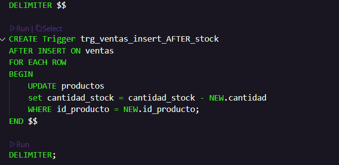  
   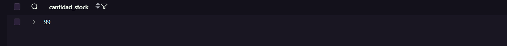
   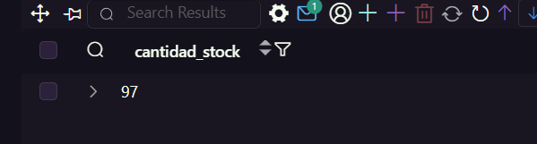  

2. **Bloquear ventas sin suficiente stock**  
   Impide registrar ventas si la cantidad solicitada supera el stock disponible.
   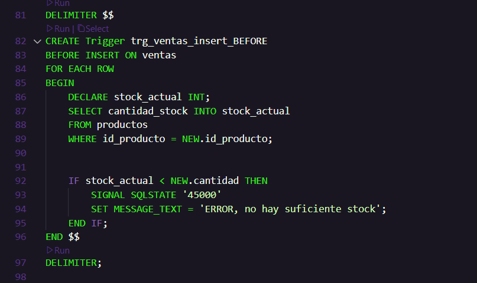  
   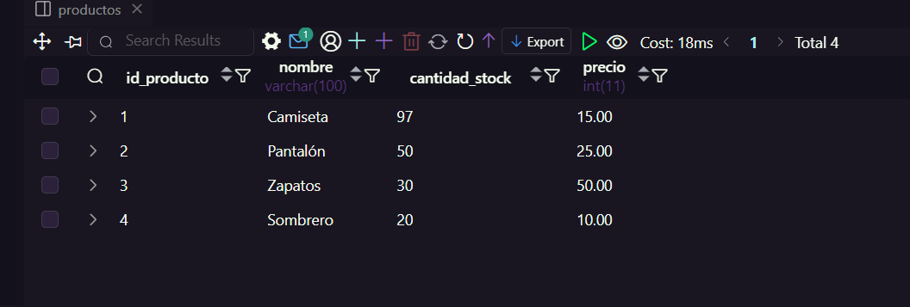
   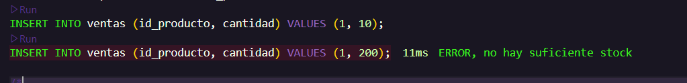  
3. **Aumentar el precio si supera $40**  
   Incrementa el precio del producto en un 5% si vale más de $40 al venderlo.
   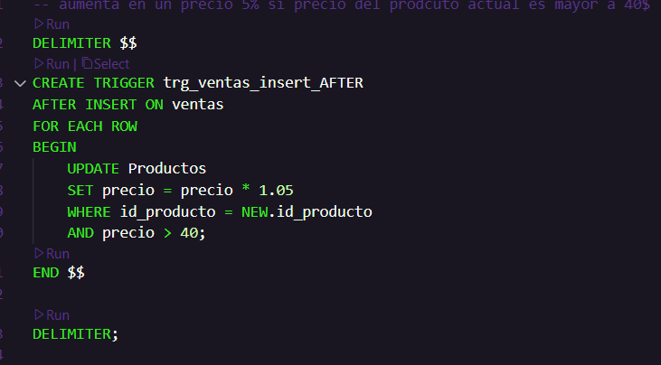  
   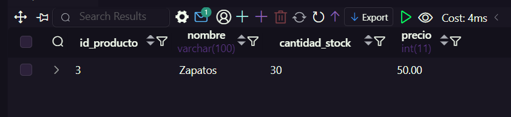
   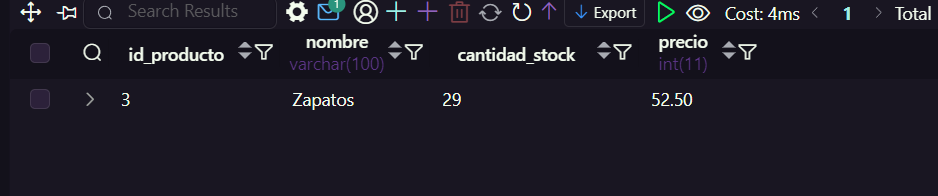  
4. **Registrar cambios de precio en log_precios**  
   Guarda un historial con cada actualización de precio.
   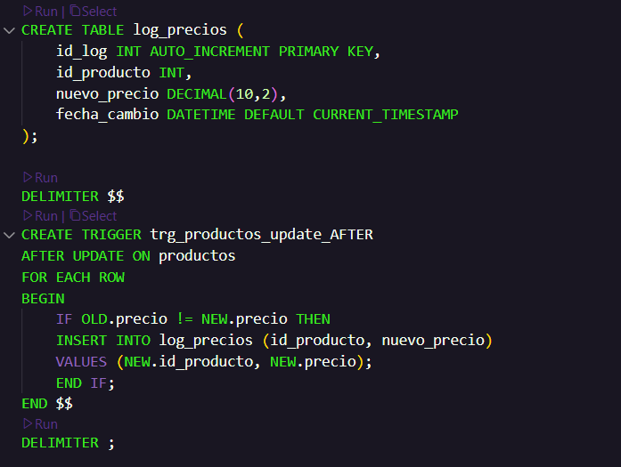  
   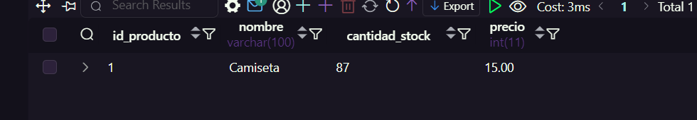  
   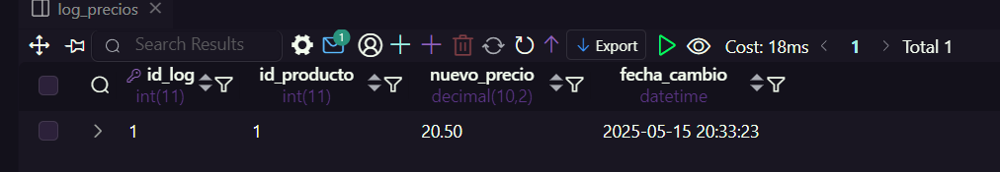
5. **Aumentar stock al eliminar una venta**  
   Restaura el stock si se elimina una venta.
   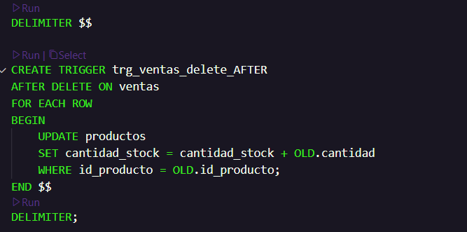  
   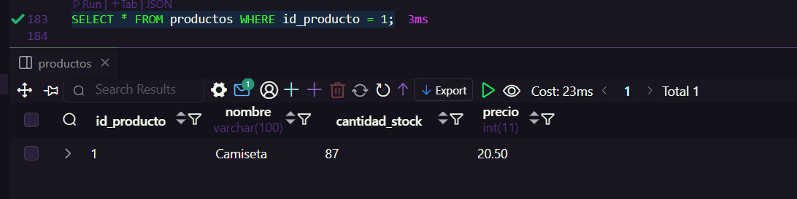  
   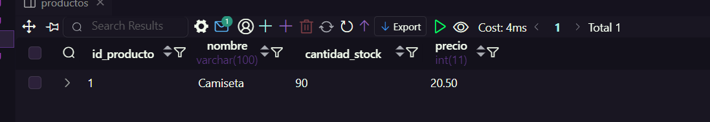
6. **Bloquear eliminación de productos con stock**  
   No permite eliminar productos si aún tienen unidades en stock.
   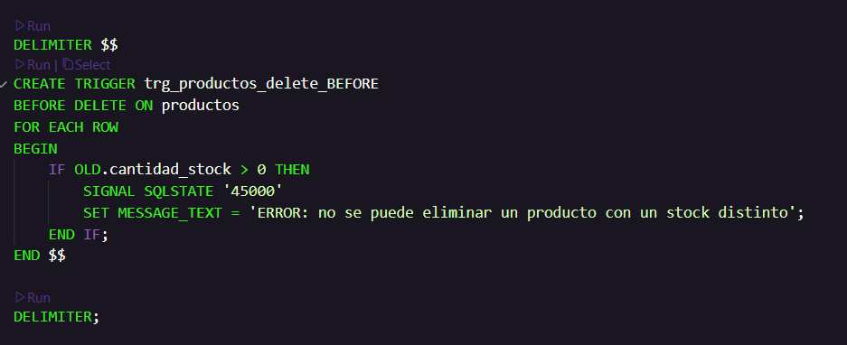  
   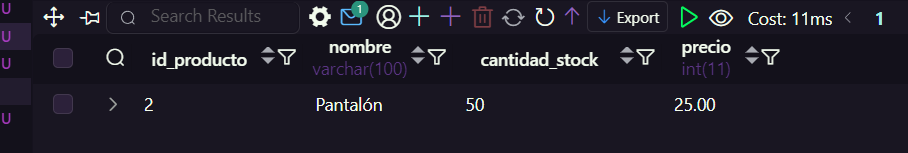  
   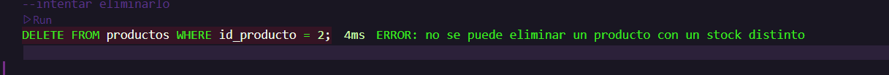
7. **Advertencia por producto sin stock (venta prohibida)**  
   Bloquea ventas si el producto está totalmente agotado.
   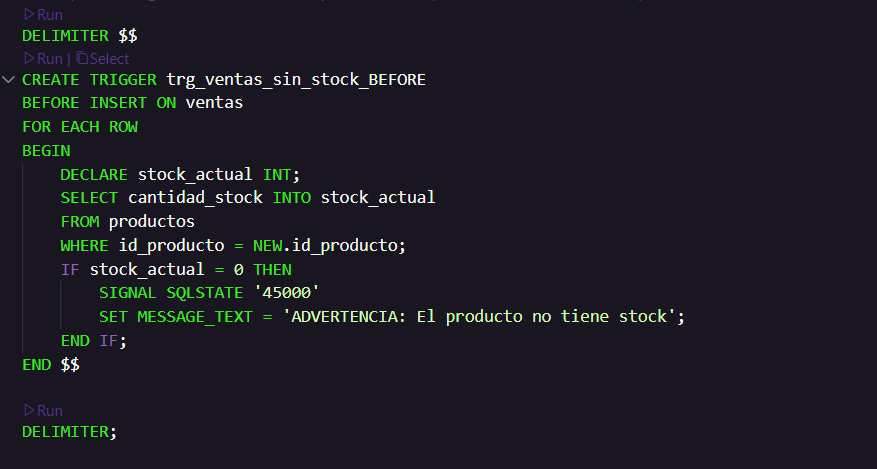  
   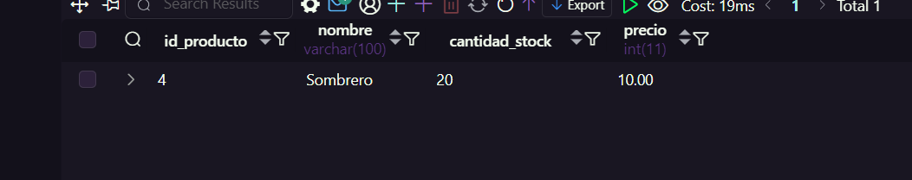  
   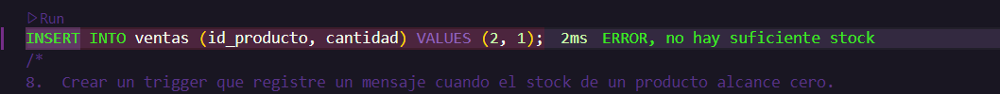
8. **Mensaje si un producto se agota tras una venta**  
   Muestra advertencia si el stock llega a 0 tras venderlo.
   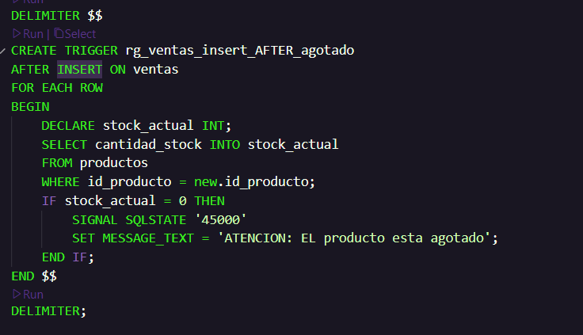  
   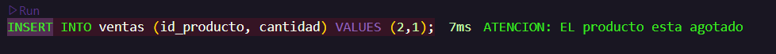
9. **Marcar productos en promoción**  
   Activa una bandera `en_promocion` si el precio baja de $5.
   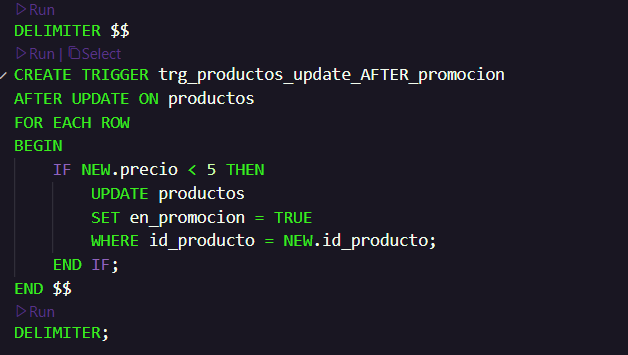  
   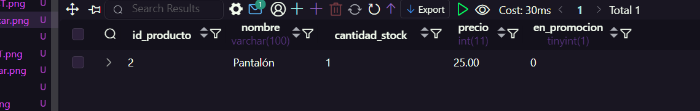
10. **Registrar total de la venta**  
    Calcula y guarda el total de cada venta en la tabla `total_ventas`.
   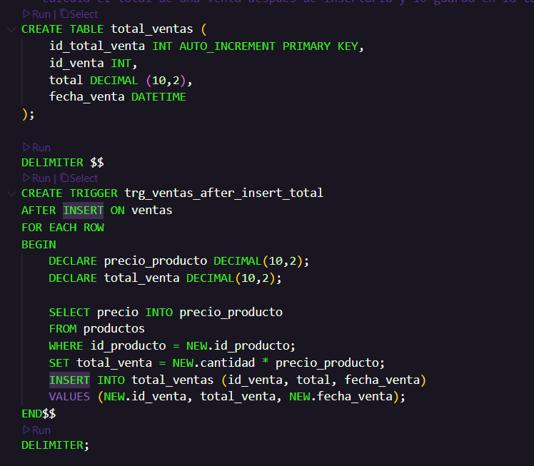  
   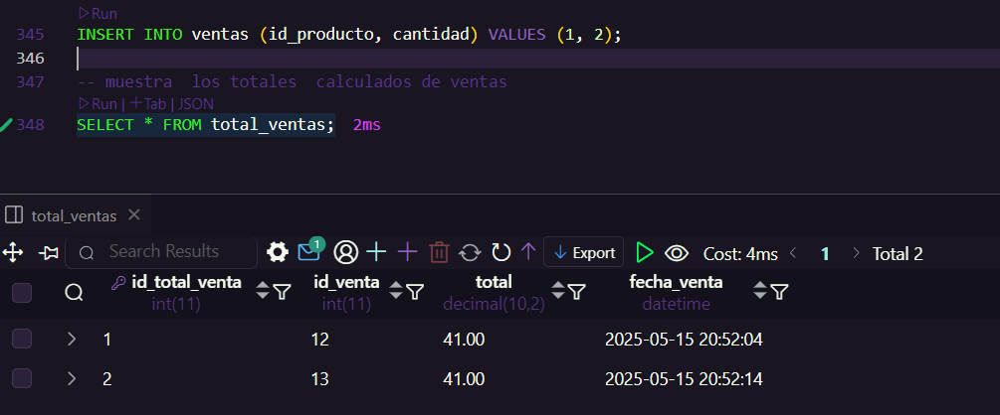